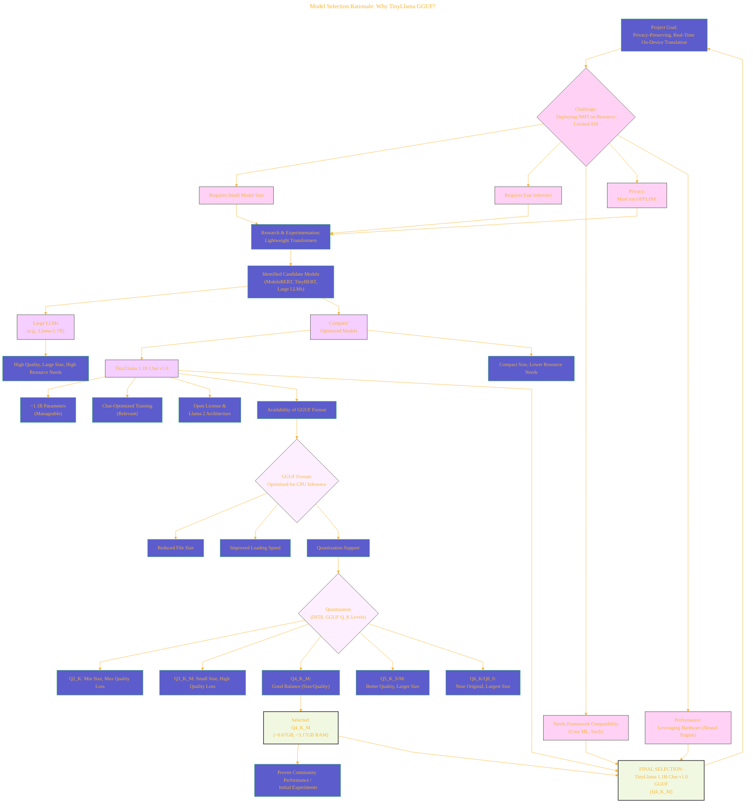
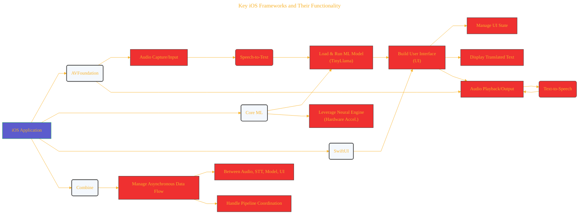
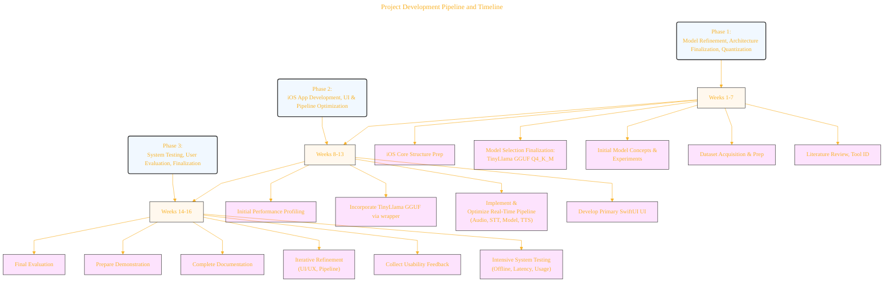
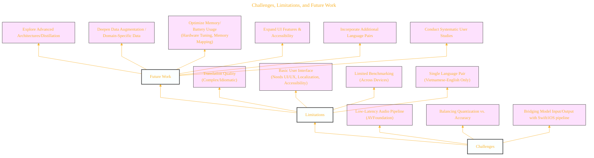

# Visual Representation of Project Concepts
> **Disclaimer:**
>
> This document contains my personal notes on the topic,
> compiled from publicly available documentation and various cited sources.
> The materials are intended for educational purposes, personal study, and reference.
> The content is dual-licensed:
> 1. **MIT License:** Applies to all code implementations (Swift, Mermaid, and other programming languages).
> 2. **Creative Commons Attribution 4.0 International License (CC BY 4.0):** Applies to all non-code content, including text, explanations, diagrams, and illustrations.
---

Based on the comprehensive LaTeX document detailing the project "Privacy-Preserving Real-Time Vietnamese-English Translation on iOS using Edge AI," the following diagrams provide visual representations of the core architecture, model rationale, development process, and related aspects.


## 1. On-Device AI Translation Pipeline Architecture

This diagram illustrates the core data flow and components of the on-device translation system as described in the methodology and technical highlights.

```mermaid
---
title: "On-Device AI Translation Pipeline Architecture"
author: "Cong Le"
version: "1.0"
license(s): "MIT, CC BY 4.0"
copyright: "Copyright (c) 2025 Cong Le. All Rights Reserved."
config:
  layout: dagre
  theme: base
---
%%%%%%%% Mermaid version v11.4.1-b.14
%%%%%%%% Available curve styles include the following keywords:
%% basis, bumpX, bumpY, cardinal, catmullRom, linear, monotoneX, monotoneY, natural, step, stepAfter, stepBefore.
%%{
  init: {
    'flowchart': { 'htmlLabels': false, 'curve': 'linear' },
    'fontFamily': 'Monaco',
    'themeVariables': {
      'primaryColor': '#22BB',
      'primaryTextColor': '#F8B229',
      'lineColor': '#F8B229',
      'primaryBorderColor': '#27AE60',
      'secondaryColor': '#EEF0',
      'secondaryTextColor': '#6C3483',
      'secondaryBorderColor': '#A569BD',
      'fontSize': '15px'
    }
  }
}%%
flowchart TD
  My_Meme@{ img: "https://raw.githubusercontent.com/CongLeSolutionX/MY_GRAPHIC_ASSETS/refs/heads/Designing_graphic_syntax/MY_MEME/My-meme-icon-design.png", label: "User Voice Input", pos: "b", w: 100, h: 100, constraint: "on" }

    My_Meme --> B("AVFoundation <br/>- Audio Capture")
    B --> C("Native iOS Speech-to-Text")
    C --> D{"Text Input<br/>(Vietnamese)"}
    D --> E("Core ML /<br/>Local LLM Wrapper")
    E --> F["TinyLlama 1.1B Chat v1.0 GGUF<br/>(Q4_K_M)"]
    E --> G("On-Device Inference")
    G --> H{"Translated Text Output<br/>(English)"}
    H --> I("SwiftUI UI Display")
    H --> J("AVFoundation <br/>- Text-to-Speech")
    J --> K["Translated Speech Output"]

    %% Styling and grouping
    subgraph Edge_AI_Processing["Edge AI Processing<br/>(On Device)"]
    style Edge_AI_Processing fill:#2f11,stroke:#333,stroke-width:2px
        D
        E
        F
        G
        H
    end
    subgraph Core_iOS_Frameworks["Core iOS Frameworks"]
    style Core_iOS_Frameworks fill:#22f1,stroke:#333,stroke-width:2px
       B
       C
       I
       J
    end

   classDef coreML fill:#21ff,stroke:#333,stroke-width:2px
   class F coreML
   class G coreML

   classDef framework fill:#c22,stroke:#333,stroke-width:2px
   class B framework
   class C framework
   class I framework
   class J framework

   classDef inputoutput fill:#f21c2,stroke:#333,stroke-width:2px
   class My_Meme inputoutput
   class D inputoutput
   class H inputoutput
   class K inputoutput
   
```


---

## 2. Model Selection Rationale: Why TinyLlama GGUF?

This graph highlights the decision process and key factors leading to the selection of the TinyLlama 1.1B Chat v1.0 in GGUF format with Q4\_K\_M quantization.



---

## 3. Key iOS Frameworks and Their Functionality

This diagram illustrates how specific iOS frameworks are integrated and utilized within the project's pipeline.



---

## 4. Project Development Pipeline and Timeline

This flowchart outlines the three distinct phases of the project's execution timeline (Spring 2025).



----

## 5. Challenges, Limitations, and Future Work

This diagram groups related points concerning the hurdles faced, current shortcomings, and planned future directions for the project.




---
<!-- 
```mermaid
%% Current Mermaid version
info
``` 
-->


```mermaid

---
title: "CongLeSolutionX"
author: "Cong Le"
version: "1.0"
license(s): "MIT, CC BY 4.0"
copyright: "Copyright (c) 2025 Cong Le. All Rights Reserved."
config:
  theme: base
---
%%{
  init: {
    'flowchart': { 'htmlLabels': false },
    'fontFamily': 'Brush Script MT',
    'themeVariables': {
      'primaryColor': '#fc82',
      'primaryTextColor': '#F8B229',
      'primaryBorderColor': '#27AE60',
      'secondaryColor': '#81c784',
      'secondaryTextColor': '#6C3483',
      'lineColor': '#F8B229',
      'fontSize': '20px'
    }
  }
}%%
flowchart LR
    My_Meme@{ img: "https://github.com/CongLeSolutionX/MY_GRAPHIC_ASSETS/blob/Designing_graphic_syntax/MY_MEME_ICONS/Orange-Cloud-Search-Icon-Base-Color-Black-1024x1024.png?raw=true", label: "Ăn uống gì chưa ngừi đẹp?", pos: "b", w: 200, h: 150, constraint: "on" }

    Closing_quote@{ shape: braces, label: "Math and code work together to bring interactive art to life!" }

My_Meme ~~~ Closing_quote

```

---
>**Licenses:**
>
>- **MIT License:**  [](LICENSE) - Full text in [LICENSE](LICENSE) file.
>- **Creative Commons Attribution 4.0 International:** [](LICENSE-CC-BY) - Legal details in [LICENSE-CC-BY](LICENSE-CC-BY) and at [Creative Commons official site](http://creativecommons.org/licenses/by/4.0/).