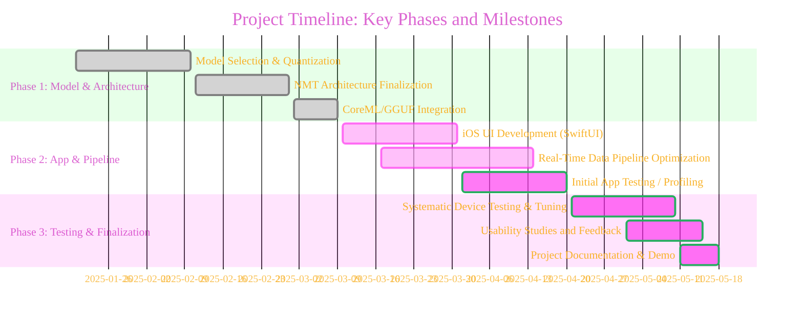
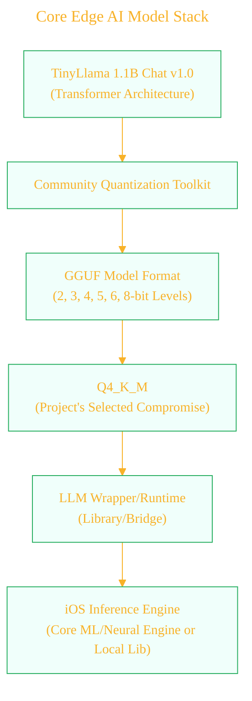
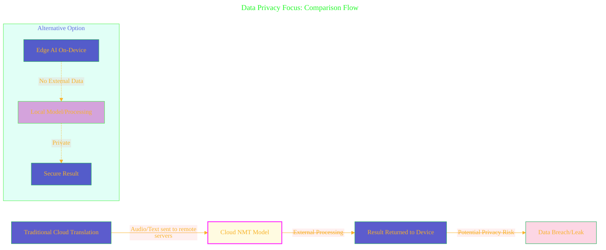
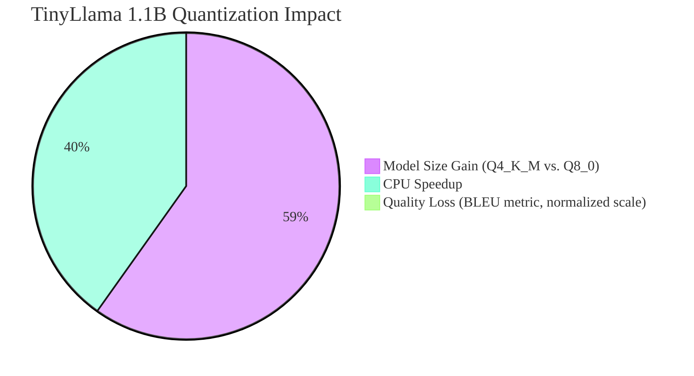
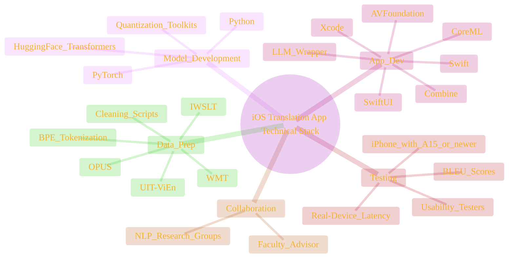
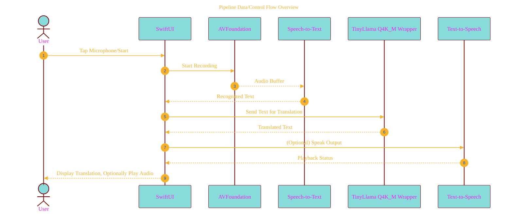
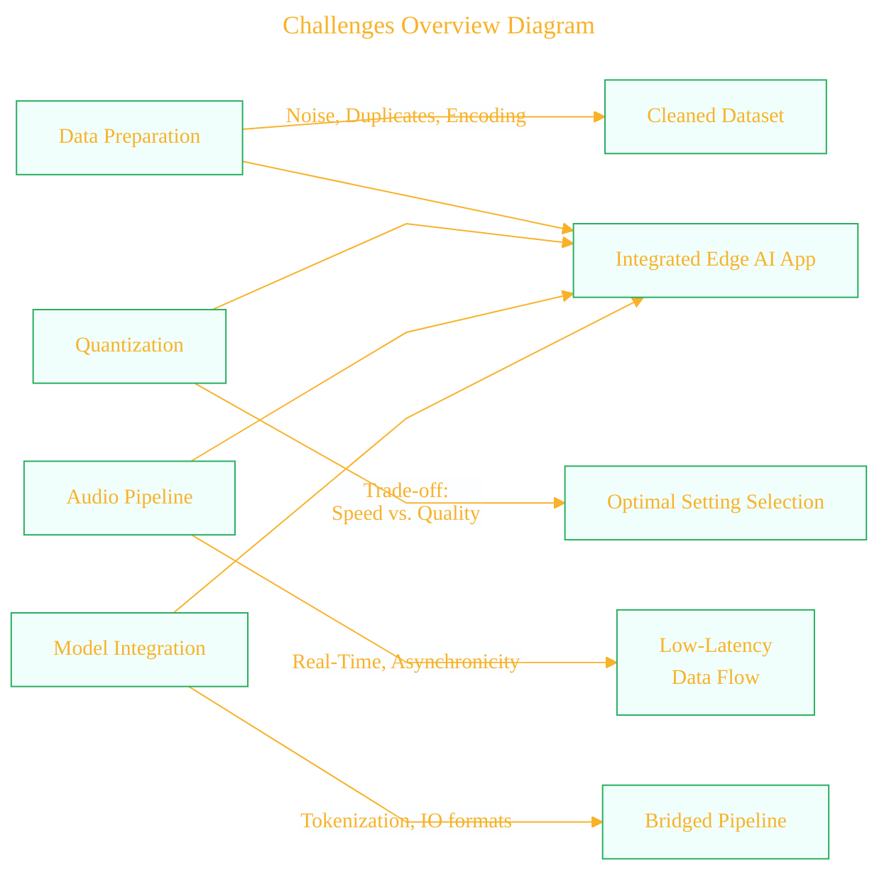
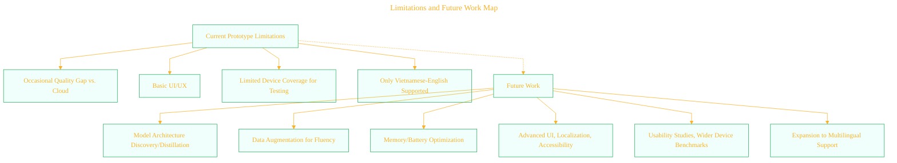

# Visual Schematic Collection for "Privacy-Preserving Real-Time Vietnamese-English Translation on iOS using Edge AI"
> **Disclaimer:**
>
> This document contains my personal notes on the topic,
> compiled from publicly available documentation and various cited sources.
> The materials are intended for educational purposes, personal study, and reference.
> The content is dual-licensed:
> 1. **MIT License:** Applies to all code implementations (Swift, Mermaid, and other programming languages).
> 2. **Creative Commons Attribution 4.0 International License (CC BY 4.0):** Applies to all non-code content, including text, explanations, diagrams, and illustrations.
---

The following diagrams and illustrative models are designed to visually convey the complex technical concepts, methodology, architecture, and insights detailed in the reviewed LaTeX paper. They utilize Mermaid syntax for clear and modern presentation, and are intended for inclusion in an article, thesis, or as supporting content for presentations.

---

## 1. High-Level System Architecture: On-Device AI Translation Pipeline


```mermaid
---
title: "High-Level System Architecture: On-Device AI Translation Pipeline"
author: "Cong Le"
version: "1.0"
license(s): "MIT, CC BY 4.0"
copyright: "Copyright (c) 2025 Cong Le. All Rights Reserved."
config:
  layout: dagre
  theme: base
---
%%%%%%%% Mermaid version v11.4.1-b.14
%%%%%%%% Available curve styles include the following keywords:
%% basis, bumpX, bumpY, cardinal, catmullRom, linear, monotoneX, monotoneY, natural, step, stepAfter, stepBefore.
%%{
  init: {
    'flowchart': { 'htmlLabels': false, 'curve': 'linear' },
    'fontFamily': 'Monaco',
    'themeVariables': {
      'primaryColor': '#2FB1',
      'primaryTextColor': '#F8B229',
      'lineColor': '#F8B229',
      'primaryBorderColor': '#27AE60',
      'secondaryColor': '#EBF2',
      'secondaryTextColor': '#6C3483',
      'secondaryBorderColor': '#A569BD',
      'fontSize': '15px'
    }
  }
}%%
flowchart TD
	My_Meme@{ img: "https://raw.githubusercontent.com/CongLeSolutionX/MY_GRAPHIC_ASSETS/refs/heads/Designing_graphic_syntax/MY_MEME/My-meme-icon-design.png", label: "User Speech<br/>(Audio Input)", pos: "b", w: 100, h: 100, constraint: "on" }
	
    My_Meme --> B["Speech-to-Text<br/>(AVFoundation)"]
    B --> C{"Edge AI NMT Model<br/>(TinyLlama 1.1B Q4_K_M <br/>+ Wrapper/Core ML)"}
    C --> D["Text Postprocessing<br/>& UI Display<br/>(SwiftUI)"]
    D --> E["Optional:<br/>Text-to-Speech Output<br/>(AVFoundation)"]
    
    style C fill:#f967,stroke:#222,stroke-width:2px
    style B fill:#c6c9
    style D fill:#b5fc
    style E fill:#fcb3
    
```


**Explanation:**  
All translation and inference occur locally on the iOS device. User voice is processed directly into text, passed into the on-device quantized NMT model, then displayed (and optionally vocalized) without any user data leaving the device, ensuring privacy.

---

## 2. Project Methodology & Phase Timeline



**Explanation:**  
This Gantt chart summarizes the project execution: model and format selection, pipeline development, and multi-staged validation/refinement, concluding with comprehensive testing and demonstration.

---

## 3. Core Edge AI Model Stack



**Explanation:**  
This diagram traces the journey from model selection (TinyLlama) through quantization, efficient storage (GGUF), and final deployment as a high-performance, low-memory iOS model.

---

## 4. Data Privacy Focus: Comparison Flow



**Explanation:**  
Contrasts traditional cloud-based translation (with inherent data privacy risks) to the privacy-preserving on-device Edge AI approach in this research.

---

## 5. Quantization Trade-Offs: Size vs. Quality



**Explanation:**  
Relative illustration of efficiency gains with Q4_K_M quantization over larger/baseline models. Substantial reduction in required storage and compute for only a small drop in translation quality.

---

## 6. Technical Stack and Resource Map



**Explanation:**  
Mindmap shows the interrelated technological and human resources: from data collection and model training to app development, device testing, and academic collaboration.

---

## 7. Pipeline Data/Control Flow Overview



**Explanation:**  
Sequence diagram captures the user-driven interaction — from voice input, through model inference, to translation display and speech output.

---

## 8. Challenges Overview Diagram



**Explanation:**  
Emphasizes the main technical hurdles and the necessary coordination to bridge data, quantization, audio, and model aspects in a seamless app.

---

## 9. Limitations and Future Work Map



**Explanation:**  
Displays current limitations as starting points for proposed enhancements handled in future iterations.

---

## 10. Full Research Workflow Overview

```mermaid
---
title: "Full Research Workflow Overview"
author: "Cong Le"
version: "1.0"
license(s): "MIT, CC BY 4.0"
copyright: "Copyright (c) 2025 Cong Le. All Rights Reserved."
config:
  layout: dagre
  theme: base
---
%%%%%%%% Mermaid version v11.4.1-b.14
%%%%%%%% Available curve styles include the following keywords:
%% basis, bumpX, bumpY, cardinal, catmullRom, linear, monotoneX, monotoneY, natural, step, stepAfter, stepBefore.
%%{
  init: {
    'flowchart': { 'htmlLabels': false, 'curve': 'linear' },
    'fontFamily': 'Monaco',
    'themeVariables': {
      'primaryColor': '#2FB1',
      'primaryTextColor': '#F8B229',
      'lineColor': '#F8B229',
      'primaryBorderColor': '#27AE60',
      'secondaryColor': '#EBDEF0',
      'secondaryTextColor': '#6C3483',
      'secondaryBorderColor': '#A569BD',
      'fontSize': '15px'
    }
  }
}%%
graph LR
    A["Personal Motivation"]
      --> B["Needs Analysis<br/>(Privacy/Offline/Seamless)"]
      --> C["Research:<br/>Literature & App Review"]
      --> D["Efficient Model Design &<br/> Quantization"]
      --> E["Data Acquisition &<br/> Preparation"]
      --> F["Model Training &<br/> Export"]
      --> G["iOS Pipeline Build"]
      --> H["Testing,<br/>Feedback,<br/>Evaluation"]
      --> I["Refinement,<br/>Finalization,<br/>Demo"]
```



**Explanation:**  
Outlines the high-level trajectory of the entire effort from problem conception, through modeling and app development, to evaluation and showcase.


---
<!-- 
```mermaid
%% Current Mermaid version
info
``` 
-->


```mermaid

---
title: "CongLeSolutionX"
author: "Cong Le"
version: "1.0"
license(s): "MIT, CC BY 4.0"
copyright: "Copyright (c) 2025 Cong Le. All Rights Reserved."
config:
  theme: base
---
%%{
  init: {
    'flowchart': { 'htmlLabels': false },
    'fontFamily': 'Brush Script MT',
    'themeVariables': {
      'primaryColor': '#fc82',
      'primaryTextColor': '#F8B229',
      'primaryBorderColor': '#27AE60',
      'secondaryColor': '#81c784',
      'secondaryTextColor': '#6C3483',
      'lineColor': '#F8B229',
      'fontSize': '20px'
    }
  }
}%%
flowchart LR
    My_Meme@{ img: "https://github.com/CongLeSolutionX/MY_GRAPHIC_ASSETS/blob/Designing_graphic_syntax/MY_MEME_ICONS/Orange-Cloud-Search-Icon-Base-Color-Black-1024x1024.png?raw=true", label: "Ăn uống gì chưa ngừi đẹp?", pos: "b", w: 200, h: 150, constraint: "on" }

    Closing_quote@{ shape: braces, label: "Math and code work together to bring interactive art to life!" }

My_Meme ~~~ Closing_quote

```


---
>**Licenses:**
>
>- **MIT License:**  [](LICENSE) - Full text in [LICENSE](LICENSE) file.
>- **Creative Commons Attribution 4.0 International:** [](LICENSE-CC-BY) - Legal details in [LICENSE-CC-BY](LICENSE-CC-BY) and at [Creative Commons official site](http://creativecommons.org/licenses/by/4.0/).