---

## 1. **Semantic Review: Key Components and Flow**

### **A. Architectural Overview**

- **`AICardView`** is a SwiftUI View that serves as a chat interface for asking questions *by voice* in Vietnamese, and then relaying the response from a local LLM (Large Language Model).
- **Voice functionality** is two-fold:
    - **Speech-to-Text**: Converts user's spoken Vietnamese question to text via **Speech framework** (SFSpeechRecognizer & AVAudioEngine).
    - **Text-to-Speech**: Reads out the AI's answer aloud using **AVSpeechSynthesizer**.
- The **AI logic** uses a local model (TinyLlama/Arcee-VyLinh, quantized) loaded via a `LLM` abstraction and queried asynchronously.
- Extensive **state management** ensures:
    - User's question and AI's answer are displayed and voiced,
    - Loading, error, and permission states are clearly presented to the user.
- **Permissions** for both speech recognition and microphone usage are requested and handled.
- **Error handling** is structured and user-facing, using custom error types (`AIError`) with localized descriptions.

### **B. Core Functional Flow**

1. **User taps mic button**:
    - If not recording:
        - Microphone and speech permissions checked/requested.
        - Recording starts and transcribes user's question in Vietnamese.
    - If recording:
        - Recording stops, final transcription is produced.
2. **On final transcription**:
    - The transcribed question is sent asynchronously to the local LLM.
    - Spinner/progress shows during processing.
    - AI's response is displayed AND spoken aloud via TTS.
3. **Error management**:
    - At any stage (permission denied, recording issues, LLM errors), clear error messages appear in the card.

---

## 2. **Visual Explanations (Mermaid Diagrams)**

---

### **A. Top-Level App Architecture**

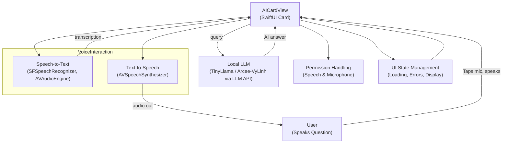

- **Legend**: All flows are mediated by the `AICardView`, which orchestrates user input, permissions, AI calls, and output.

---

### **B. UI State Machine: What the User Sees**

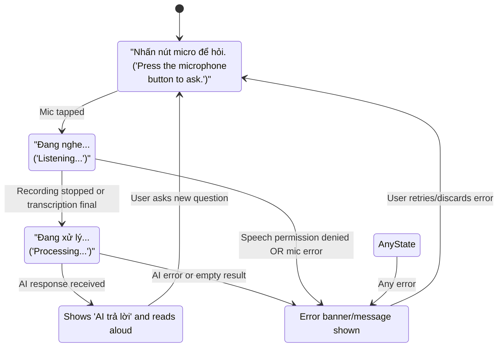

---

### **C. Detailed Sequence: Voice-to-AI-to-Voice Pipeline**

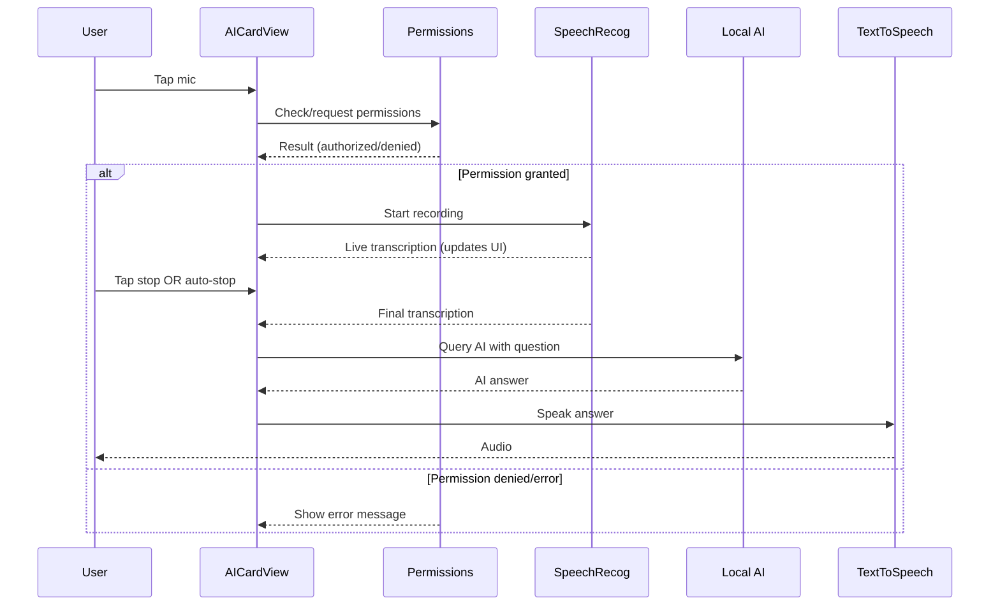

---

### **D. AIModel Loading and Error Handling**

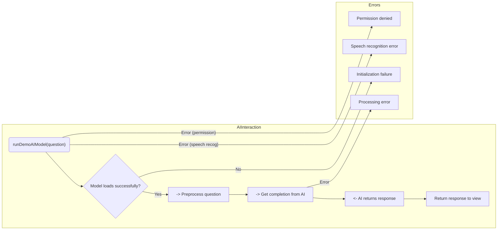

---

### **E. Speech Recognition Flow**

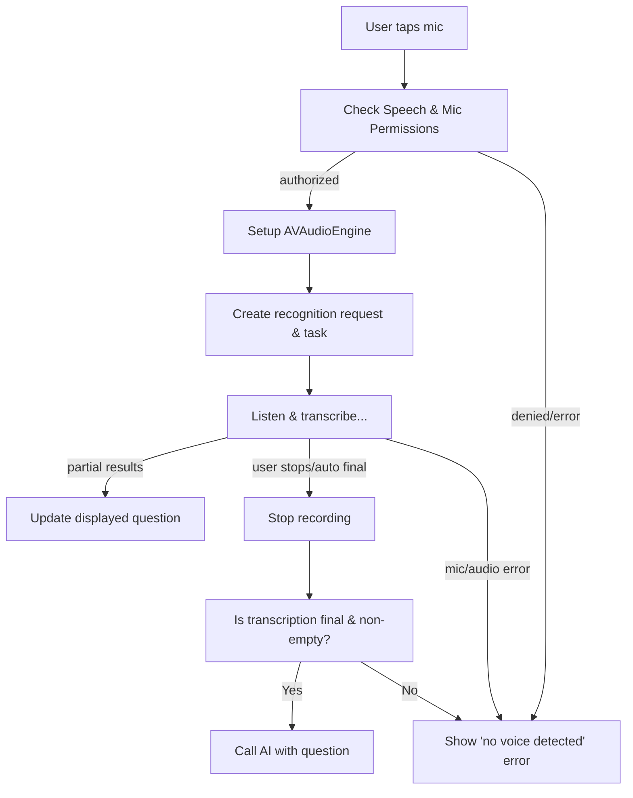

---

### **F. Error Handling Map**

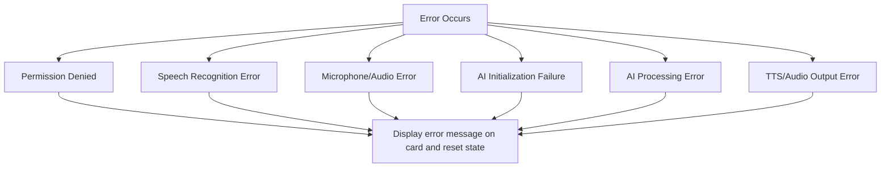

---

### **G. Core Data Structures & Dependencies**

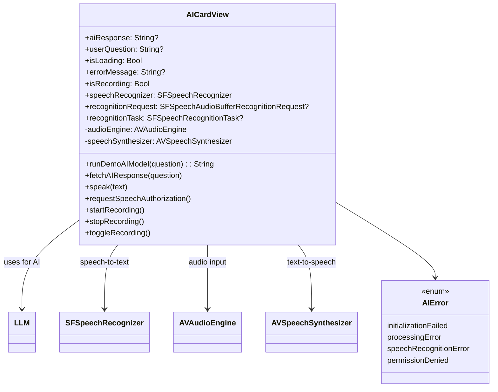

---

### **H. Permissions Decision Tree**

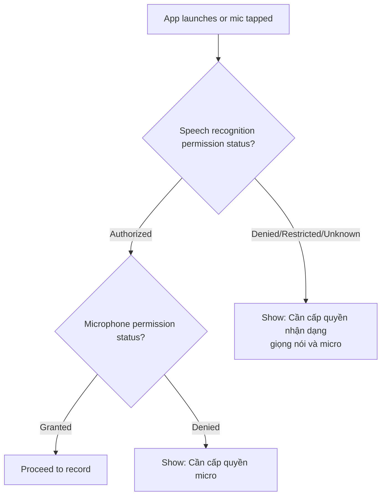

---

### **I. Data & UI State Synchronization**

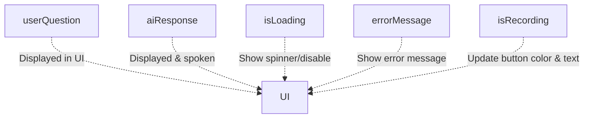

---

### **J. Quantization Model Impact (AI Loading)**

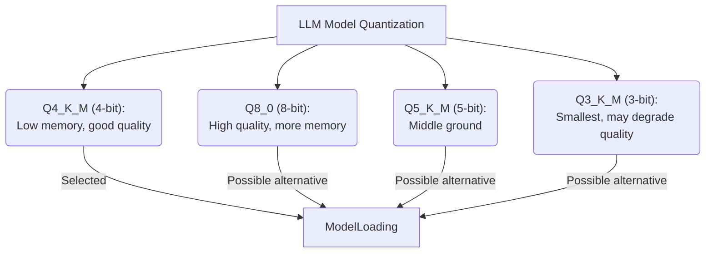
*Shows developer’s comments on memory/quality tradeoffs.*

---

## 3. **Concept Map: End-to-End User Journey**

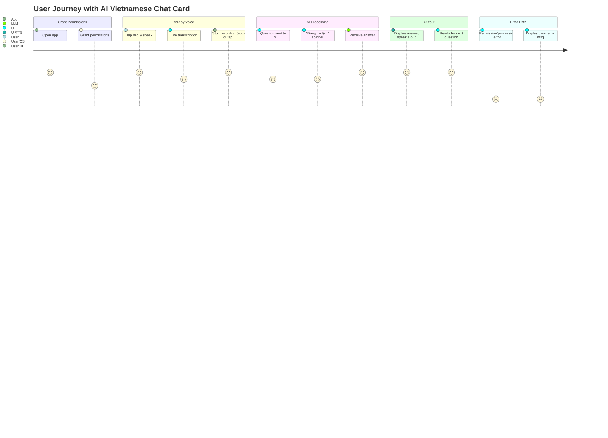

---

# **Summary Table**

| Aspect                         | Visual Diagram | Concepts Illustrated                                |
|---------------------------------|---------------|-----------------------------------------------------|
| **Overall Data Flow**           | A             | All moving parts: UI, AI, speech, permissions       |
| **UI State Transitions**        | B             | States: idle, recording, processing, error, answer  |
| **Interaction Sequence**        | C             | Timeline and message sequence for a user action     |
| **AI Model Handling**           | D             | Model initialization, error branches                |
| **Speech Recognition Details**  | E             | Stepwise logic from tap to transcription & error    |
| **Error Handling**              | F             | Mapping errors to user-facing UI                    |
| **Class & State Structure**     | G             | Objects, state variables, dependencies              |
| **Permissions Logic**           | H             | Nested permission checks and outcomes               |
| **State Synchronization**       | I             | UI updates and their triggers                       |
| **LLM Quantization Choice**     | J             | Memory/quality tradeoffs in LLM selection           |
| **User Journey**                | Journey Map   | Bird’s-eye view of app usage scenario               |

---

## **How to Read These Diagrams**

- **Flowcharts:** Show logical or data pathways and choices.
- **State diagrams:** Depict how the UI state changes with actions or results.
- **Sequence diagrams:** Clarify interaction timeline and message flow between components and actors.
- **Class diagrams:** Map out how code entities connect.
- **Journey diagrams:** Visualize the high-level user-centered journey.
- **Quantization tradeoff:** Relates a developer concern.

---
