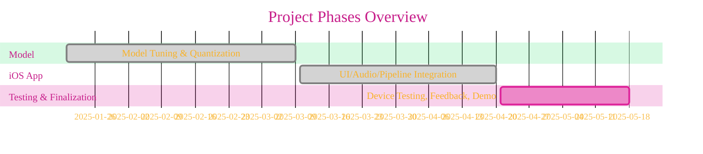
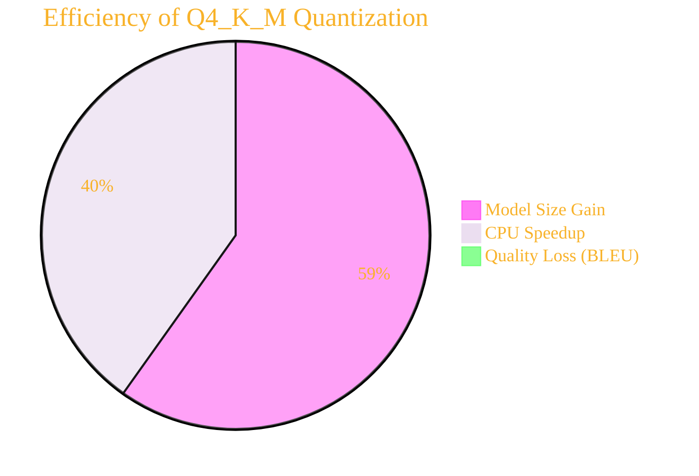

# Privacy-Preserving Real-Time Vietnamese-English Translation on iOS Using Edge AI 
[](LICENSE)  [](LICENSE-CC-BY)

<!-- Optional: Add a badge for "Exploration Status: Ongoing" or similar -->

>Copyright (c) 2025 Cong Le. All Rights Reserved.

---


## Overview

This project implements a **fully offline, privacy-focused, real-time Vietnamese-English Neural Machine Translation (NMT) system** for iOS devices. By leveraging the efficient and open-source [TinyLlama 1.1B Chat v1.0](https://huggingface.co/TinyLlama/TinyLlama-1.1B-Chat-v1.0) LLM, quantized and deployed in the [GGUF format](https://github.com/ggerganov/llama.cpp), it realizes edge AI translation with **no user data ever leaving the device**. The prototype integrates AVFoundation for voice input/output, Core ML and a local LLM wrapper for on-device inference, and SwiftUI for a seamless app experience.  

---

## Table of Contents

- [Privacy-Preserving Real-Time Vietnamese-English Translation on iOS Using Edge AI](#privacy-preserving-real-time-vietnamese-english-translation-on-ios-using-edge-ai)
  - [Overview](#overview)
  - [Table of Contents](#table-of-contents)
  - [Key Features](#key-features)
  - [Project Rationale](#project-rationale)
  - [Architecture Overview](#architecture-overview)
  - [Technical Stack](#technical-stack)
  - [Model Workflow](#model-workflow)
  - [Privacy Considerations](#privacy-considerations)
  - [Performance](#performance)
  - [Limitations](#limitations)
  - [Future Work](#future-work)
  - [Project Visuals](#project-visuals)
    - [System Architecture](#system-architecture)
    - [Development Timeline](#development-timeline)
    - [Quantization Benefits](#quantization-benefits)
  - [Code Implementation](#code-implementation)
  - [Citation \& References](#citation--references)
  - [License](#license)
  - [Contact](#contact)

---

## Key Features

- **Fully Offline Translation:** All processing stays on device—works anywhere, anytime, without connectivity.
- **Robust Privacy:** No user audio, text, or metadata is sent to any external server.
- **Real-Time NMT:** Sub-second response for common conversational phrases.
- **Efficient Edge AI Deployment:** Utilizes TinyLlama 1.1B Q4_K_M quantized LLM for a balance of speed, size, and accuracy.
- **User-Friendly UI:** SwiftUI-driven interface for smooth, transparent translation experience.
- **Speech I/O Integration:** Voice input (STT) and spoken output (TTS) via AVFoundation.

---

## Project Rationale

Existing translation apps are either:
- **Cloud-based:** Raise privacy concerns and need internet connectivity.
- **Local but basic:** Limited language or use rule-based/statistical methods—lagging in quality.

**This project delivers:**  
- Quality, privacy, and reliability with advanced neural models directly on consumer devices.

---

## Architecture Overview

```mermaid
---
title: "Architecture Overview"
author: "Cong Le"
version: "1.0"
license(s): "MIT, CC BY 4.0"
copyright: "Copyright (c) 2025 Cong Le. All Rights Reserved."
config:
  layout: dagre
  theme: base
---
%%%%%%%% Mermaid version v11.4.1-b.14
%%%%%%%% Available curve styles include the following keywords:
%% basis, bumpX, bumpY, cardinal, catmullRom, linear, monotoneX, monotoneY, natural, step, stepAfter, stepBefore.
%%{
  init: {
    'flowchart': { 'htmlLabels': false, 'curve': 'linear' },
    'fontFamily': 'Monaco',
    'themeVariables': {
      'primaryColor': '#2FB1',
      'primaryTextColor': '#F8B229',
      'lineColor': '#F8B229',
      'primaryBorderColor': '#27AE60',
      'secondaryColor': '#EEF0',
      'secondaryTextColor': '#6C3483',
      'secondaryBorderColor': '#A569BD',
      'fontSize': '15px'
    }
  }
}%%
flowchart TD
	My_Meme@{ img: "https://raw.githubusercontent.com/CongLeSolutionX/MY_GRAPHIC_ASSETS/refs/heads/Designing_graphic_syntax/MY_MEME/My-meme-icon-design.png", label: "User Audio", pos: "b", w: 100, h: 100, constraint: "on" }

    My_Meme --> B["Speech-to-Text<br/>(AVFoundation)"]
    B --> C["TinyLlama NMT Model<br/>(Q4_K_M, GGUF)"]
    C --> D["SwiftUI UI"]
    D --> E["Text-to-Speech<br/>(Optional)"]
    
```

- **All steps local.**  
- **No external data flow.**

---

## Technical Stack

- **Model Training / Prep:**  
    - Python, PyTorch, HuggingFace Transformers
    - Quantization toolkit (GGUF)
    - BLEU evaluation, data cleaning scripts
    - Public datasets: WMT, OPUS, IWSLT, UIT-ViEn

- **iOS Development:**  
    - Xcode, Swift, SwiftUI
    - AVFoundation (STT, TTS)
    - Core ML and/or local LLM wrapper for inference
    - Combine framework for reactive data flow

- **Testing:**  
    - Modern iPhone devices (A15 Bionic+)
    - Empirical latency & BLEU
    - Usability feedback
    - Faculty and research group review

---

## Model Workflow

1. **Model Selection:**  
   - Lightweight, conversational LLM (TinyLlama 1.1B) fine-tuned on dialogue.
2. **Quantization:**  
   - GGUF format, Q4_K_M level (4-bit), balances size and performance.
3. **Deployment:**  
   - Model embedded and loaded within the iOS app via suitable wrapper.
4. **End-to-End Pipeline:**  
   - Record audio → STT → Input to NMT → Output translation (UI + TTS).

---

## Privacy Considerations

- Unlike traditional apps, **no audio/text leaves your device**.
- App functions with WiFi/cellular turned off.
- Secure, on-device processing prevents interception, misuse, or data leaks.

---

## Performance

- **Model size:** ~0.67GB (Q4_K_M quantization)
- **Peak RAM usage:** ~3.1GB (during inference)
- **Latency:** Typically <100ms per sentence (iPhone devices, subject to device generation)
- **Quality:** Practical BLEU scores for conversational context; small drop compared to large unquantized models.

---

## Limitations

- **Advanced idiomatic translation**: Not yet on par with large online commercial systems
- **UI basic:** Prototype-focused; not production-polished
- **Device compatibility:** Optimized for recent hardware; older devices may experience reduced performance
- **Language support:** Only Vietnamese-English for this version
- **Testing:** Wider real-world and accessibility evaluation still needed

---

## Future Work

- Further shrink model via distillation/neural architecture search
- Add language pairs and domain-specific vocabulary
- Enhance UI/UX and add robust accessibility options
- Deepen on-device optimizations (battery/memory)
- Larger-scale user studies and device testing

---

## Project Visuals

### System Architecture

```mermaid
---
title: "System Architecture"
author: "Cong Le"
version: "1.0"
license(s): "MIT, CC BY 4.0"
copyright: "Copyright (c) 2025 Cong Le. All Rights Reserved."
config:
  layout: dagre
  theme: base
---
%%%%%%%% Mermaid version v11.4.1-b.14
%%%%%%%% Available curve styles include the following keywords:
%% basis, bumpX, bumpY, cardinal, catmullRom, linear, monotoneX, monotoneY, natural, step, stepAfter, stepBefore.
%%{
  init: {
    'flowchart': { 'htmlLabels': false, 'curve': 'linear' },
    'fontFamily': 'Monaco',
    'themeVariables': {
      'primaryColor': '#2FB1',
      'primaryTextColor': '#F8B229',
      'lineColor': '#F8B229',
      'primaryBorderColor': '#27AE60',
      'secondaryColor': '#EEF0',
      'secondaryTextColor': '#6C3483',
      'secondaryBorderColor': '#A569BD',
      'fontSize': '15px'
    }
  }
}%%
flowchart TD
	My_Meme@{ img: "https://raw.githubusercontent.com/CongLeSolutionX/MY_GRAPHIC_ASSETS/refs/heads/Designing_graphic_syntax/MY_MEME/My-meme-icon-design.png", label: "User Audio", pos: "b", w: 100, h: 100, constraint: "on" }
	
    My_Meme --> AB["iOS App<br/>(UI)"]
    AB --> AC["AVFoundation: STT"]
    AC --> AD["TinyLlama<br/>(GGUF, Q4_K_M)"]
    AD --> AE["UI Output"]
    AE --> AF["AVFoundation: TTS<br/>(optional)"]
    
```


### Development Timeline



### Quantization Benefits



---

## Code Implementation

The full codebase (including SwiftUI, AVFoundation integration, Core ML/local model wrapper usage, and supporting scripts) is available in the [Ask a Le GitHub repo](https://github.com/congleai/Ask-a-Le).

- 📦 **Repository:** [github.com/congleai/Ask-a-Le](https://github.com/congleai/Ask-a-Le)
- 📝 Includes: iOS app source code, model loading/inference, dataset scripts, and setup instructions.

---

## Citation & References

- [TinyLlama-1.1B-Chat-v1.0](https://huggingface.co/TinyLlama/TinyLlama-1.1B-Chat-v1.0)
- [TheBloke: GGUF Quantized Models](https://huggingface.co/TheBloke/)
- [Core ML Documentation](https://developer.apple.com/documentation/coreml)
- [AVFoundation Documentation](https://developer.apple.com/documentation/avfoundation)
- [Combine Documentation](https://developer.apple.com/documentation/combine)
- [llama.cpp GGUF Format](https://github.com/ggerganov/llama.cpp)
- [OPUS Parallel Corpus](https://opus.nlpl.eu/)
- [WMT Shared Task](https://www.statmt.org/wmt23/translation-task.html)
- …see full paper for details.

---

## License

See [LICENSE](./LICENSE) for terms.  
Model license: [TinyLlama License](https://huggingface.co/TinyLlama/TinyLlama-1.1B-Chat-v1.0)

---

## Contact

**Primary Author:** Cong Le  
**Advisor:** Dr. Ning Chen  
Department of Computer Science, California State University, Fullerton

---

<!-- 


---
> *This project is a research proof-of-concept.*
> *For academic or experimental use only.*
---